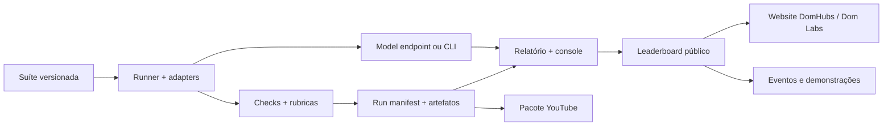

# DHEvals — plano de construção completo

Este documento transforma a decisão “vamos gerar absolutamente tudo” em uma sequência executável. O DHEvals é o primeiro produto a ser fechado; a website institucional, a plataforma de eventos e os demais produtos da DomHubs entram depois como superfícies que reutilizam a mesma prova, marca e infraestrutura.

## Ordem de construção



## Fases do DHEvals

### Estado atual dos gates (2026-08-02)

| Gate | Estado | Evidência |
| --- | --- | --- |
| Fixture v0.2 completa | concluído | 10/10 tarefas, fixture positivo e fixture negativo |
| Adapter HTTP v0.2 | concluído | contract test executando a mesma matriz sem alterar o manifesto |
| Adapter CLI genérico | concluído | OpenCode, Qwen, Kimi e outros CLIs rodam por stdin/argumento sem shell |
| Preflight SaciLM | concluído | chamada única valida contrato antes do full run e não expõe segredos |
| Console/relatórios/publicação | concluído | Playwright E2E + JSON/HTML/CSV/YouTube + leaderboard locked |
| Verificação de reprodutibilidade | concluído | `dhevals-verify` valida manifesto, prompts, resultados e relatório antes da promoção |
| Métricas operacionais | concluído | latência/tokens sempre registrados; custo USD opcional por pricing explícito |
| Auditoria da matriz v0.2 | concluído | `dhevals-audit` valida suite, fixtures, 150 âncoras e registry antes da rodada |
| Release gate de publicação | concluído | `dhevals-release-gate` reconcilia run/report/verificação/auditoria/calibração/leaderboard; estado atual `blocked` |
| Matriz heavy-user v0.3 expandida | concluído | 20 tarefas, 60 dimensões, 300 âncoras; audit/fixture/HTTP offline válidos, calibração humana pendente |
| Manifesto SaciLM/Unsloth/RunPod | concluído | schema validado, hash canônico embutido em cada run, credenciais bloqueadas e gate `ready` exige checkpoint/dataset hash, commit, image e configuração concretos; arquivo inicial ainda `draft` |
| Mapa de tooling de pós-training | concluído | caminho Unsloth/RunPod documentado com alternativas Axolotl, LLaMA-Factory, torchtune, TRL, serving e tracking sem acoplar o runner |
| Pacotes de calibração cega | concluído | `pack.json` fixa hashes e fingerprint das 150/300 âncoras; notas continuam pendentes de dois revisores |
| Comparação multi-modelo archive-only | concluído | wrapper local executa SaciLM + baseline na v0.3, com preflight, reports verificados e console pública preservada |
| Promoção transacional do SaciLM | concluído | preflight, leaderboard candidato e release gate são avaliados fora de `public/data`; manifesto draft/calibração pendente não substituem a baseline |
| Promoção transacional de comparações | concluído | comparação usa SaciLM como run primário, valida gate candidato fora de `public/data` e só então atualiza rodada/leaderboard/catálogos |
| Finalização do manifesto pronto | concluído | `finalize:sacilm-manifest` materializa proveniência concreta a partir de envs e valida sem mutar o draft |
| Histórico de runs na console | concluído | `run-catalog.json` deduplica reports arquivados e expõe status/publicação sem recalcular scores |
| Registry de modelos na console | concluído | lanes aparecem com suites, provider, adapter HTTP/CLI e estado de configuração sem expor segredos |
| Workspace de revisão na console | concluído | fila v0.2/v0.3, score 0–4, notas locais, export/validate CSV cego e fluxo CLI de adjudicação; nenhuma nota sintética é publicada |
| Registry de datasets | concluído | manifesto versionado com licença, privacidade, proveniência, consumidores e hash; catálogo público sem PII |
| Scorecard transparente | concluído | qualidade determinística, métricas operacionais e dimensões não medidas explicitamente `not_evaluated`; safety/agentic/judge entram por artefatos independentes |
| Cobertura do scorecard | concluído | `scorecard_coverage` nomeia evidência e estado das 14 dimensões sem transformar lacunas em proxies |
| Tracking de experimentos | concluído | lineage de run, modelo, suíte, configuração, métricas, hash e artefato em `experiment-catalog.json` |
| Execução de comparação | concluído | contrato same-suite para as lanes registradas, com `primary_model_id` e score bloqueado até release gate em `comparison-execution-latest.json` |
| API read-only | concluído | `/healthz` e rotas versionadas para runs, modelos, suítes, datasets, scorecards, judge, calibração, experimentos, comparações, matrizes e leaderboard |
| Contratos judge/safety/agent | concluído | validação executável, fixtures versionados e testes para evidência do juiz, casos de segurança e limites de aprovação/tool-use |
| Execução LLM-as-a-Judge | concluído | `dhevals-judge-run` avalia cada dimensão por endpoint OpenAI-compatible, normaliza 0–4 para 0–1 e invalida respostas incompletas sem fabricar zero |
| Meta E2E documentada | concluído | critérios de aceite, comandos de evidência e gates externos em `docs/dhevals-e2e-goal.md` |
| Matriz executável de testes v0.2/v0.3 | concluído | 30 tarefas, 60 cenários positivo/negativo, 90 dimensões de tarefa, 450 anchors, 14 dimensões de scorecard e 2 lanes de modelo versionados com hashes |
| Execução consolidada da matriz | concluído | `test:matrix` executa as quatro combinações positivo/negativo, gera report/verify e expõe o artefato `test-execution-latest.json` |
| Execução das lanes independentes | concluído | `test:independent` executa judge, safety e agent em fixtures versionados sem alterar o scorecard público |
| Readiness operacional do SaciLM | concluído | checklist seguro de manifesto, endpoint, preflight, dataset, matriz e calibração, exposto também via API |
| Auditoria da meta E2E | concluído | `audit:goal` materializa evidência local, gates externos, cobertura da matriz e estado seguro da calibração v0.3 |
| Handoff de calibração v0.3 | concluído | pack, fingerprint, SHA-256 dos dois CSVs, estado por revisor e comandos de importação sem notas sintéticas |
| Checklist de readiness na console | concluído | Settings lista cada gate, motivo e próxima ação a partir do artefato seguro; navegação mobile mantém nomes acessíveis |
| Documentação pública empacotada | concluído | hooks `predev`, `prebuild` e `prepreview` sincronizam os 15 `docs/dhevals-*.md` para `public/docs`; `test:public-docs` detecta drift e o E2E valida Markdown servido |
| Bundle de produção verificável | concluído | `test:production-bundle` confirma `dist` com console, readiness, handoff, artefatos públicos e os 15 documentos sem divergência |
| Seleção automática do manifesto pronto | concluído | após `finalize:sacilm-manifest`, readiness, preflight, runner, comparação, auditoria e model catalog não voltam silenciosamente ao template draft |
| Endpoint real SaciLM | pendente | depende de URL RunPod/OpenAI-compatible e checkpoint publicado |
| Calibração humana | pendente | 300 grupos v0.3 aguardam dois revisores e adjudicação; o pacote cego já está pronto |

O SaciLM está explicitamente em standby. O próximo trabalho pode usar a lane
genérica `run:model` ou registries com `adapter: "command-line"` para executar
OpenCode, Qwen, Kimi e outros modelos sem esperar manifesto, checkpoint ou
endpoint do SaciLM.

### Fase A — núcleo reproduzível (agora)

- manifesto de suíte e tarefas em JSON versionado;
- carregador/validador de schema;
- adapter fixture para desenvolvimento offline;
- adapters OpenAI-compatible e CLI para qualquer modelo;
- checks determinísticos e agregação por tarefa/categoria;
- manifesto de rodada com configuração, métricas, erros e hashes;
- testes automatizados do núcleo.
- smoke E2E da console, cobrindo execução fixture, sincronização do artefato, inspector, sources, Director view e refresh de rodada.

### Fase B — suíte heavy-user calibrada

- 1–2 tarefas por categoria do documento de fundação;
- matriz v0.2 inicial com dez categorias, dez tarefas e fixture reproduzível;
- entradas sintéticas/licenciadas em pt-BR;
- rubricas com exemplos de resposta e casos-limite;
- revisão humana dupla de uma amostra;
- gate automatizado para duas notas por âncora e adjudicação de desacordo;
- conjunto público e conjunto de calibração privado, se fizer sentido;
- pesos e política de empate registrados antes da primeira publicação.

### Fase C — execução real de uma lane escolhida

- definir endpoint ou CLI de inferência;
- registrar a proveniência disponível (manifesto, revisão, runtime e custos);
- executar smoke test, depois a suíte completa;
- separar erro de modelo, erro de prompt, timeout e erro de infraestrutura;
- congelar o primeiro relatório comparável.

### Fase D — produto público

- conectar resultados reais à console visual existente;
- páginas de run, tarefa, modelo, suíte e relatório;
- filtros por categoria, versão e configuração;
- export JSON/CSV/HTML;
- modo Director para gravação;
- pacote de roteiro factual para YouTube;
- leaderboard derivado de reports, com fixtures e rodadas incompletas bloqueadas;
- leaderboard somente depois de a política de versões estar estável.

### Fase E — operação e confiança

- registry de modelos de comparação com endpoint e status explícitos;
- changelog e hashes de cada suíte;
- aprovação/revisão de tarefas;
- auditoria de dados e licenças;
- snapshots de custo/latência;
- observabilidade de runs;
- API read-only para consumidores externos;
- scorecard separado para qualidade, safety, custo, velocidade e dimensões ainda não medidas;
- documentação pública de metodologia e limitações.

## Estratégia de testes dos benchmarks

Cada camada terá um tipo de teste específico:

| Camada | Teste | O que impede |
| --- | --- | --- |
| Schema | unitário | suíte inválida ou tarefa duplicada |
| Grader | golden fixtures | pontuação que muda sem mudança no output |
| Adapter | contract test | diferença silenciosa entre provedores |
| Runner | integração fixture | perda de tarefa, métrica ou erro |
| Reprodutibilidade | snapshot/hash | prompt ou configuração trocada após o run |
| Suíte | revisão humana | rubrica ambígua ou enviesada |
| Live SaciLM | smoke + full run | endpoint quebrado ou timeout sistêmico |
| Console | E2E visual/interação | resultado correto, mas ilegível no vídeo |

Nenhuma pontuação pública será liberada sem passar pelos testes de schema, grader, runner, reprodutibilidade e revisão da amostra.

## Estrutura alvo do repositório

```text
apps/
  console/                 # superfície React/Vite do DHEvals
packages/
  dhevals_core/            # schema, adapters, runner, grading, CLI
benchmarks/
  suites/                  # manifestos e fixtures versionados
reports/                   # artefatos locais de execução (não segredos)
docs/
  dhevals-*.md             # decisões, metodologia e ledgers
```

A console atual permanece na raiz durante a fundação para manter o fluxo funcionando. A migração para `apps/console` só acontece quando existir uma segunda aplicação ou um backend que justifique o monorepo físico.

## Critério de passagem para a rodada SaciLM

O próximo gate é objetivo: uma suíte fixture inteira passa, a mesma suíte roda
via adapter HTTP ou CLI sem alteração nos tasks, a console consome o JSON
produzido e o `npm run test:e2e` prova o caminho visual. Só então uma lane real
é promovida; a rodada do SaciLM continua opcional enquanto ele estiver em
standby.

## Decisões que continuam abertas

1. endpoint/runtime que servirá o SaciLM;
2. lista fechada e licença dos casos da suíte heavy-user v0.1;
3. política de divulgação do conjunto privado de calibração;
4. limite de custo/tempo e hardware da rodada;
5. política de revisão humana e atualização de versão.
